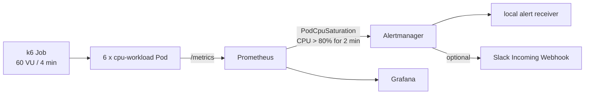

# Kubernetes Monitoring Lab

Rancher Desktop의 K3s에서 다수 Pod의 CPU 부하를 관측하고, Prometheus 규칙과 Alertmanager를 거쳐 Grafana 및 Slack 알림까지 확인하는 로컬 실습입니다.

## 구성



| 영역 | 구성 |
| --- | --- |
| Kubernetes | Rancher Desktop K3s, context `rancher-desktop` |
| 관측 스택 | `kube-prometheus-stack` chart `88.1.3` |
| 데모 워크로드 | `cpu-workload` Deployment, 6 replicas, Pod당 CPU limit `250m` |
| 부하 | 클러스터 내부 `grafana/k6:0.57.0`, 60 VU, 4분 |
| 알림 | CPU 사용량/CPU limit > 80%가 2분 지속되면 `PodCpuSaturation` |

자세한 구조는 [설계 문서](docs/architecture.md), 운영과 장애 대응은 [운영 가이드](docs/runbook.md)를 참고하세요.

## 사전 조건

- Rancher Desktop에서 Kubernetes가 활성화되어 있고 `kubectl config current-context`가 `rancher-desktop`을 가리킴
- `kubectl`, `helm`, `nerdctl`, Go 1.24 이상 설치
- Helm 저장소 최초 등록

```sh
helm repo add prometheus-community https://prometheus-community.github.io/helm-charts
helm repo update
```

## 빠른 시작

저장소 루트에서 실행합니다.

```sh
make deploy
```

이 명령은 사전 점검과 테스트를 수행하고, 로컬 containerd에 이미지를 빌드한 뒤 Prometheus/Grafana/Alertmanager 및 데모 리소스를 배포합니다.

Grafana는 다음 명령으로 출력되는 port-forward를 별도 터미널에서 실행한 뒤 `http://localhost:3000`으로 접속합니다. 대시보드 이름은 **Kubernetes Monitoring Lab**입니다.

```sh
make dashboard
```

## 알림 재현

```sh
make load
make verify-alert
```

`make load`는 기존 `cpu-load` Job을 교체하고 완료까지 대기합니다. 부하가 시작된 뒤 약 2분 후 `PodCpuSaturation`이 firing하며, Job 종료 후 resolved 됩니다. `make verify-alert`는 로컬 Alertmanager receiver 로그에서 이 알림을 확인합니다.

## Slack 알림

1. Slack App의 Incoming Webhook을 알림 채널에 설치합니다.
2. URL을 환경 변수로만 전달해 Secret과 AlertmanagerConfig를 생성합니다.

```sh
SLACK_WEBHOOK_URL='https://hooks.slack.com/services/...' make enable-slack
```

Webhook URL은 비밀 값입니다. 파일, Git, 터미널 기록, 채팅에 저장하지 마세요. URL이 노출되면 Slack에서 재생성한 뒤 위 명령을 다시 실행해 Secret을 교체합니다.

Slack 메시지의 Alertmanager 링크를 열기 전에는 별도 터미널에서 다음 명령을 계속 실행합니다.

```sh
make alertmanager
```

이 port-forward는 `localhost:19093`을 열고, Alertmanager가 새 Slack 알림에 생성하는 URL과 일치합니다. 이미 발송된 Slack 메시지의 내부 DNS 링크는 바뀌지 않으므로 새 알림에서 확인해야 합니다.

## 명령 참조

| 명령 | 목적 |
| --- | --- |
| `make preflight` | Rancher Desktop 노드, Helm, containerd 연결 확인 |
| `make test` | Go race test 및 핵심 Helm 값 검증 |
| `make deploy` | 이미지 빌드와 전체 배포 |
| `make load` | CPU 포화 부하 Job 실행 및 완료 대기 |
| `make verify-alert` | 로컬 receiver의 `PodCpuSaturation` 수신 확인 |
| `make dashboard` | Grafana port-forward 명령 출력 |
| `make alertmanager` | Alertmanager의 `localhost:19093` port-forward 실행 |
| `make enable-slack` | 환경 변수의 Webhook URL로 Slack 설정 적용 |
| `make teardown` | 이 실습이 생성한 namespace와 Helm release 제거 |

## 정리

```sh
make teardown
```

이 명령은 이 실습의 `demo`, `alerting`, `monitoring` 리소스만 삭제하고 Rancher Desktop 클러스터 및 기존 워크로드는 보존합니다.
