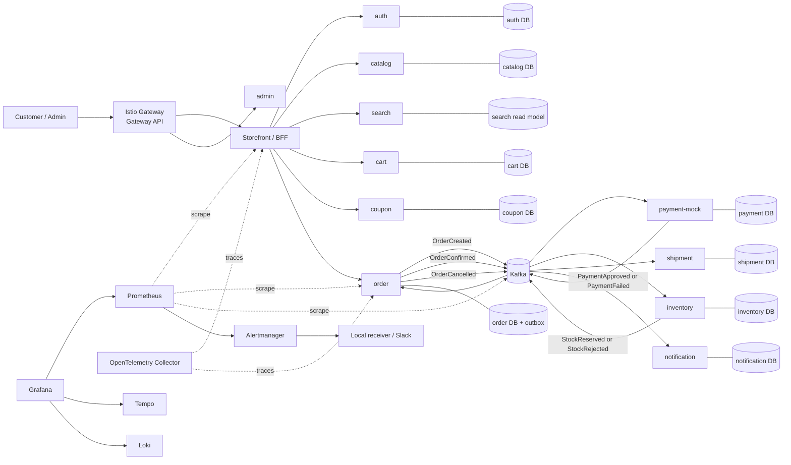
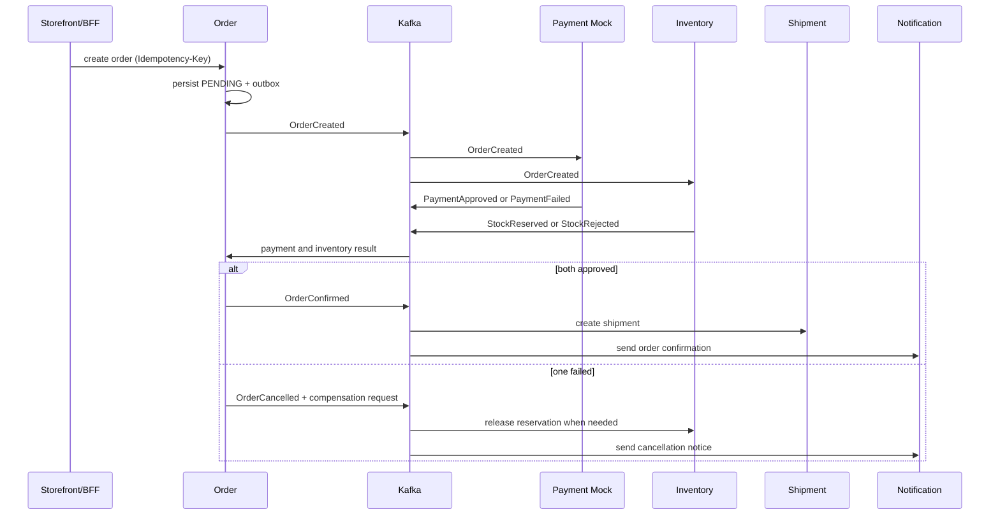

# Baro

Kubernetes 위에서 운영되는 쇼핑몰 MSA 학습 플랫폼입니다. Baro는 상품 탐색부터 주문·결제·재고·배송까지의 핵심 흐름을 서비스별로 분리하고, Kafka 기반 비동기 Saga, Istio 서비스 메시, Gateway API, 관측성, 부하·복구 검증을 하나의 재현 가능한 환경으로 다룹니다.

> **문서 기준:** 이 README는 Baro의 목표 아키텍처와 운영 구성이 모두 완성된 상태를 기준으로 합니다.

## 목표

- Kubernetes에서 독립 배포·확장 가능한 쇼핑몰 MSA를 운영한다.
- 주문 처리의 동기 경계와 Kafka 이벤트 기반 비동기 경계를 구분한다.
- Istio와 Gateway API로 외부 진입 경로 및 서비스 간 통신 정책을 운영한다.
- metrics, logs, traces와 SLO 기반 알림으로 주문 흐름을 추적한다.
- k6와 Chaos Toolkit으로 성능, 정확성, 장애 복구를 검증한다.

## 아키텍처



### 서비스 경계

| 서비스 | 책임 | 동기 API | 비동기 이벤트 |
| --- | --- | --- | --- |
| `storefront` / `bff` | 고객 화면, 세션 전달, 화면용 API 조합 | 상품·장바구니·주문 조회/요청 | 없음 |
| `auth` | 회원, 인증, 권한 | 로그인·토큰 검증 | 회원 상태 변경 |
| `catalog` | 상품, 가격, 카테고리 | 상품 목록·상세 | 상품 변경 |
| `search` | 검색 인덱스와 조회 모델 | 키워드 검색 | 상품 변경 구독 |
| `cart` | 장바구니 | 항목 추가·수정·삭제 | 장바구니 체크아웃 요청 |
| `coupon` | 쿠폰 발급·검증·사용 | 적용 가능 쿠폰 확인 | 쿠폰 사용·복원 |
| `order` | 주문 상태와 Saga 조정 | 주문 생성·조회·취소 | 주문 생성·확정·취소 |
| `payment-mock` | 테스트용 결제 승인·거절 | 없음 | 결제 승인·실패 |
| `inventory` | 재고 확인·예약·복원 | 재고 조회 | 재고 예약·거절·복원 |
| `shipment` | 출고·배송 상태 | 배송 조회 | 출고 생성·배송 상태 변경 |
| `notification` | 주문·배송 알림 발송 | 없음 | 주문·배송 알림 요청 |
| `admin` | 운영자 상품·재고·주문 관리 | 운영 API | 없음 |

각 서비스는 자신의 PostgreSQL 저장소를 소유합니다. 다른 서비스의 데이터베이스를 직접 조회하지 않으며, 필요한 읽기 모델은 API 조회 또는 Kafka 이벤트 구독으로 갱신합니다.

## 주문 Saga와 데이터 정합성



- `order`는 상태와 outbox event를 하나의 로컬 트랜잭션으로 저장한 뒤 publisher가 Kafka에 전달합니다.
- producer 재시도와 consumer 재전달을 전제로 모든 consumer는 이벤트 ID를 기록해 멱등 처리합니다.
- 고객의 주문 생성 요청은 `Idempotency-Key`로 중복 생성되지 않습니다.
- 처리 불가 이벤트는 재시도 한도를 넘으면 DLQ로 이동하며, DLQ 건수와 outbox backlog는 알림 대상입니다.
- 주문 생성처럼 멱등성이 보장되지 않은 HTTP 요청에는 mesh 수준의 자동 재시도를 적용하지 않습니다.

## Kubernetes, Istio, Gateway API

Baro는 Rancher Desktop의 K3s를 기본 개발 환경으로 사용합니다. 서비스는 namespace와 ServiceAccount로 격리되며, 각 workload에는 request/limit, readiness/liveness probe, HPA, PodDisruptionBudget를 둡니다.

- **Gateway API**: `Gateway`와 `HTTPRoute`가 외부 HTTP 진입, TLS 종료, 고객·운영 API 경로 분리를 담당합니다.
- **Istio**: sidecar 기반 mTLS, AuthorizationPolicy, timeout, circuit breaking, traffic splitting을 제공합니다.
- **트래픽 정책**: 배포는 canary 방식으로 진행하며, 오류율·p95 latency·consumer lag가 기준을 넘으면 이전 revision으로 되돌립니다.
- **보안**: 서비스 간 통신은 기본 거부 정책에서 필요한 identity만 허용합니다. 비밀 값은 Git에 저장하지 않고 Kubernetes Secret 또는 외부 secret provider로 주입합니다.

## 관측성

| 신호 | 도구 | 주요 지표·질문 |
| --- | --- | --- |
| Metrics | Prometheus + Grafana | 요청률, 오류율, p95/p99, CPU·메모리 포화, HPA, DB pool |
| Events | Kafka exporter / 애플리케이션 metrics | topic 처리율, consumer lag, retry, DLQ, outbox backlog |
| Traces | OpenTelemetry Collector + Tempo | 한 주문이 BFF, order, Kafka consumer, payment, inventory를 어떻게 통과했는가 |
| Logs | Loki | trace ID·order ID로 묶은 오류와 보상 처리 이력 |
| Alerts | Alertmanager | SLO burn, 5xx, 지연 증가, lag 미복구, DLQ, Pod 포화 |

Grafana 대시보드는 **Traffic → Saturation → Latency → Errors** 순으로 배치합니다. 주문 대시보드는 결제·재고 결과, Saga 상태별 주문 수, Kafka 지연, 멱등 중복 억제 수, E2E p95/p99을 함께 보여 줍니다. Alertmanager는 로컬 receiver로 먼저 전달을 검증하고, 필요할 때만 Slack Incoming Webhook을 추가합니다.

## 빠른 시작

### 사전 조건

- Rancher Desktop에서 Kubernetes 활성화
- `kubectl config current-context`가 `rancher-desktop`
- `kubectl`, `helm`, `nerdctl`, `make` 설치
- Helm repository 등록

```sh
helm repo add prometheus-community https://prometheus-community.github.io/helm-charts
helm repo update
```

### 배포

```sh
make bootstrap
make deploy
make verify
```

`bootstrap`은 Gateway API CRD, Istio, 관측성 스택을 설치합니다. `deploy`는 모든 서비스, 데이터 저장소, Kafka, 대시보드, 알림 규칙을 배포합니다. `verify`는 rollout, Gateway route, 서비스 health check, topic, database migration, 기본 주문 흐름을 확인합니다.

### 로컬 접속

```sh
make storefront
make dashboard
make trace
make alertmanager
```

각 명령은 필요한 port-forward를 시작하고 접속 URL을 출력합니다. 운영 API는 고객 storefront와 분리된 Gateway route 및 관리자 권한으로만 접근합니다.

## 부하·정확성·복구 검증

| 명령 | 시나리오 | 통과 기준 |
| --- | --- | --- |
| `make load-smoke` | 상품 조회 → 장바구니 → 주문 1건 | 주문 상태 완료, 배송 생성, 알림 요청, trace 연결 |
| `make load` | 목표 동시 사용자로 정상 주문 | 정의한 p95/p99와 오류율 SLO 충족 |
| `make load-stress` | 정상 용량을 넘는 요청 | 병목 관찰, 과부하 시 안전한 거절, 회복 후 정상 처리 |
| `make load-soak` | 장시간 현실적 부하 | 메모리·connection·disk·lag의 지속 증가 없음 |
| `make benchmark-run` | Kafka E2E 대량 이벤트 | 요청 성공률, producer/consumer 처리율 기록 |
| `make benchmark-verify` | 비동기 전달 정확성 | 고유 event/order 수 일치, 중복 저장 0, consumer lag 0 |
| `make chaos` | 복제된 Deployment Pod 종료 | 새 Pod readiness, lag 회복, 중복 없는 최종 상태 |

`k6`는 Prometheus remote-write로 테스트 지표를 전송합니다. 실행 중 또는 직후 Grafana에서 VU, 요청률, HTTP 실패율, check 성공률, p95/p99와 Kafka 지연을 확인합니다.

Chaos 실험은 선택한 복제 Deployment만 대상으로 합니다. Kafka·PostgreSQL처럼 단일 replica StatefulSet을 임의로 종료하지 않으며, 실험 전후에 consumer lag와 고유 데이터 수를 확인합니다.

## 운영 명령

| 명령 | 목적 |
| --- | --- |
| `make bootstrap` | Gateway API, Istio, 관측성 의존성 설치 |
| `make deploy` | Baro 전체 플랫폼 배포 |
| `make verify` | rollout과 기본 주문 흐름 검증 |
| `make storefront` | 고객 storefront 접속용 port-forward |
| `make dashboard` | Grafana 접속용 port-forward |
| `make trace` | Tempo 접속용 port-forward |
| `make alertmanager` | Alertmanager 접속용 port-forward |
| `make enable-slack` | 환경 변수의 Webhook으로 Slack 알림 설정 |
| `make load-smoke` | 최소 주문 흐름 검증 |
| `make load` | 정상 부하 테스트 |
| `make load-stress` | 한계·안전한 실패 검증 |
| `make load-soak` | 장기 안정성 검증 |
| `make benchmark-run` | Kafka E2E 벤치마크 실행 |
| `make benchmark-verify` | 데이터 정합성과 lag 0 확인 |
| `make chaos` | 안전 범위의 장애 복구 실험 |
| `make teardown` | Baro namespace와 Helm release 정리 |

Slack Webhook URL, 데이터베이스 비밀번호, 토큰은 환경 변수 또는 Secret으로만 전달합니다. 비밀 값을 문서, Git, 터미널 기록에 저장하지 마세요.

## 로컬 환경의 경계

Rancher Desktop K3s는 Kubernetes, MSA 경계, mesh 정책, 이벤트 처리, 관측성과 복구 절차를 학습하고 검증하기 위한 로컬 환경입니다. 단일 노드·로컬 PVC·단일 broker 구성에서 성공한 결과는 멀티 AZ Kafka 복제, EKS 노드 자동 확장, 관리형 데이터베이스의 장애 내성을 증명하지 않습니다. 실제 운영 전에는 다중 가용 영역, 백업·복구, capacity test, 보안 검토, 비용·보존 정책을 별도로 검증해야 합니다.

## 정리

```sh
make teardown
```

이 명령은 Baro가 생성한 namespace와 Helm release만 제거하며, Rancher Desktop 클러스터와 다른 workload는 보존합니다.
