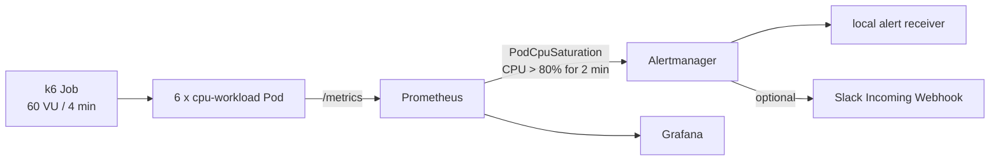

# Kubernetes Monitoring Lab

Rancher Desktop의 K3s에서 다수 Pod의 CPU 부하를 관측하고, Prometheus 규칙과 Alertmanager를 거쳐 Grafana 및 Slack 알림까지 확인하는 로컬 실습입니다.

## 구성



| 영역 | 구성 |
| --- | --- |
| Kubernetes | Rancher Desktop K3s, context `rancher-desktop` |
| 관측 스택 | `kube-prometheus-stack` chart `88.1.3` |
| 데모 워크로드 | `cpu-workload` Deployment, 6 replicas, Pod당 CPU limit `250m` |
| 부하 | 클러스터 내부 `grafana/k6:0.57.0`, 60 VU, 4분 |
| 알림 | CPU 사용량/CPU limit > 80%가 2분 지속되면 `PodCpuSaturation` |

자세한 구조는 [설계 문서](docs/architecture.md), 운영과 장애 대응은 [운영 가이드](docs/runbook.md)를 참고하세요.

## 사전 조건

- Rancher Desktop에서 Kubernetes가 활성화되어 있고 `kubectl config current-context`가 `rancher-desktop`을 가리킴
- `kubectl`, `helm`, `nerdctl`, Go 1.24 이상 설치
- Helm 저장소 최초 등록

```sh
helm repo add prometheus-community https://prometheus-community.github.io/helm-charts
helm repo update
```

## 빠른 시작

저장소 루트에서 실행합니다.

```sh
make deploy
```

이 명령은 사전 점검과 테스트를 수행하고, 로컬 containerd에 이미지를 빌드한 뒤 Prometheus/Grafana/Alertmanager 및 데모 리소스를 배포합니다.

Grafana는 다음 명령으로 출력되는 port-forward를 별도 터미널에서 실행한 뒤 `http://localhost:3000`으로 접속합니다. 대시보드는 애플리케이션 지표용 **Kubernetes Monitoring Lab** 및 k6 실행 지표용 **k6 Load Test**를 제공합니다. `make load`는 k6 지표를 Prometheus remote-write로 전송하므로, 실행 중 또는 완료 직후 **k6 Load Test**에서 VU·요청률·HTTP 실패율·check 성공률·p95/p99 지연을 확인할 수 있습니다.

```sh
make dashboard
```

두 대시보드는 모두 **Traffic → Saturation → Latency → Errors** 순서로 배치됩니다. demo에서는 요청 처리율, Pod CPU/limit 비율(80% target), CPU-work p95/p99, HTTP 거절·취소를 확인합니다. Kafka에서는 승인 이벤트율, consumer backlog, E2E p95/p99, HTTP 거절·Kafka publish 실패·insert·멱등 중복 억제를 분리해 확인합니다. `idempotently suppressed`는 저장 실패가 아니라 `ON CONFLICT DO NOTHING`으로 안전하게 중복을 무시한 결과입니다.

## 알림 재현

```sh
make load
make verify-alert
```

`make load`는 기존 `cpu-load` Job을 교체하고 완료까지 대기합니다. 부하가 시작된 뒤 약 2분 후 `PodCpuSaturation`이 firing하며, Job 종료 후 resolved 됩니다. `make verify-alert`는 로컬 Alertmanager receiver 로그에서 이 알림을 확인합니다.

## Slack 알림

1. Slack App의 Incoming Webhook을 알림 채널에 설치합니다.
2. URL을 환경 변수로만 전달해 Secret과 AlertmanagerConfig를 생성합니다.

```sh
SLACK_WEBHOOK_URL='https://hooks.slack.com/services/...' make enable-slack
```

Webhook URL은 비밀 값입니다. 파일, Git, 터미널 기록, 채팅에 저장하지 마세요. URL이 노출되면 Slack에서 재생성한 뒤 위 명령을 다시 실행해 Secret을 교체합니다.

Slack 메시지의 Alertmanager 링크를 열기 전에는 별도 터미널에서 다음 명령을 계속 실행합니다.

```sh
make alertmanager
```

이 port-forward는 `localhost:19093`을 열고, Alertmanager가 새 Slack 알림에 생성하는 URL과 일치합니다. 이미 발송된 Slack 메시지의 내부 DNS 링크는 바뀌지 않으므로 새 알림에서 확인해야 합니다.

## Kafka MSA 100만 건 벤치마크

기존 CPU 알림 실습과 분리된 `kafka-benchmark` namespace에서 다음 흐름을 실행합니다.

```text
k6 (1,000,000 events) -> ingest API -> Kafka -> consumer x3 -> PostgreSQL
```

```sh
make benchmark-deploy
make benchmark-run
make benchmark-verify
```

`make benchmark-deploy`는 새 Rancher Desktop 클러스터에서도 monitoring Helm release를 먼저 설치하고, 로컬 `k8s-monitoring-lab:dev` 이미지를 다시 빌드한 뒤 ingest/consumer Deployment를 명시적으로 재시작합니다. 따라서 같은 이미지 태그를 사용하더라도 소스 수정 후 재실행하면 새 바이너리로 교체됩니다.

`benchmark-run`은 100개의 VU가 정확히 1,000,000개의 고유 `event_id`를 최대 10분 동안 전송합니다. `benchmark-verify`는 PostgreSQL의 행 수·고유 ID·ID 범위와 Kafka consumer group lag 0을 확인합니다. Grafana의 **Kafka MSA Benchmark**에서는 처리율이 유지되고 consumer backlog가 0으로 회복하며 p99 지연이 안정화되는지 확인합니다. HTTP reject와 Kafka publish failure는 0이어야 하며, `idempotently suppressed`가 증가해도 `benchmark-verify`의 고유 행 수 기준을 통과하면 at-least-once 전달의 정상 멱등 처리입니다.

로컬 환경은 단일 Rancher Desktop 노드, 단일 KRaft Kafka broker, 단일 PostgreSQL PVC입니다. 따라서 Kafka API, consumer group, 재시도와 멱등 sink의 동작을 검증하는 용도이며, AWS MSK의 멀티 AZ 복제나 EKS 노드 자동 확장·RDS Multi-AZ 장애 내성을 증명하지는 않습니다.

## Chaos Toolkit 복원력 실험

Chaos Toolkit은 호스트의 `chaos/.venv`에서 실행하며, 실험 정의는 `rancher-desktop` Kubernetes context만 사용합니다. Chaos Make target은 `CONTEXT`가 다른 값이면 Kubernetes Job을 만들기 전에 실패하므로, 부하 생성과 장애 주입이 서로 다른 클러스터로 향하지 않습니다. 실행 Journal은 `chaos/reports/`에 남지만 Git에는 포함되지 않습니다.

```sh
make chaos-setup
make chaos-validate
```

### demo workload Pod 종료

```sh
make deploy
make chaos-demo
```

이 실험은 `demo` namespace의 `cpu-workload` Pod 하나만 무작위로 종료합니다. Chaos Toolkit은 실행 전후 모두 Deployment가 6개 available replica인지 확인합니다. 성공 Journal은 `completed` 상태이며, Kubernetes Deployment controller가 새 Pod를 만들어 `6/6` Ready가 되어야 합니다.

### Kafka consumer Pod 종료

```sh
make benchmark-deploy
make chaos-kafka-consumer
```

이 명령은 100만 건 k6 부하를 시작한 뒤 active 상태를 확인하고, `kafka-benchmark` namespace의 consumer Pod 하나만 종료합니다. 실험 후에는 consumer가 `3/3`으로 복구되고 k6 threshold가 통과하며, `benchmark-verify`가 Kafka consumer lag `0`과 PostgreSQL의 정확히 100만 고유 행을 확인해야 성공입니다.

두 실험은 `monitoring` namespace, 기존 클러스터 워크로드, 그리고 단일 복제본인 Kafka/PostgreSQL StatefulSet을 대상으로 하지 않습니다. 실행을 중단한 경우에도 Pod controller가 자동 복구하므로 대상 Deployment의 rollout 상태를 먼저 확인합니다.

```sh
kubectl --context rancher-desktop -n demo rollout status deployment/cpu-workload --timeout=3m
kubectl --context rancher-desktop -n kafka-benchmark rollout status deployment/consumer --timeout=3m
```

## 명령 참조

| 명령 | 목적 |
| --- | --- |
| `make preflight` | Rancher Desktop 노드, Helm, containerd 연결 확인 |
| `make test` | Go race test 및 핵심 Helm 값 검증 |
| `make deploy` | 이미지 빌드와 전체 배포 |
| `make load` | CPU 포화 부하 Job 실행 및 완료 대기 |
| `make verify-alert` | 로컬 receiver의 `PodCpuSaturation` 수신 확인 |
| `make dashboard` | Grafana port-forward 명령 출력 |
| `make alertmanager` | Alertmanager의 `localhost:19093` port-forward 실행 |
| `make enable-slack` | 환경 변수의 Webhook URL로 Slack 설정 적용 |
| `make teardown` | 이 실습이 생성한 namespace와 Helm release 제거 |
| `make benchmark-deploy` | Kafka, PostgreSQL, ingest/consumer와 대시보드 배포 |
| `make benchmark-run` | 100만 건 k6 E2E 부하 실행 |
| `make benchmark-verify` | DB 정확성 및 consumer lag 검증 |
| `make benchmark-dashboard` | Kafka 대시보드 Grafana port-forward 명령 출력 |
| `make benchmark-down` | `kafka-benchmark` namespace만 삭제 |
| `make chaos-setup` | 호스트 Python 가상환경에 고정된 Chaos Toolkit 설치 |
| `make chaos-validate` | Chaos Toolkit으로 모든 실험 정의 검증 |
| `make chaos-demo` | cpu-workload Pod 1개 종료 및 6/6 복구 검증 |
| `make chaos-kafka-consumer` | k6 처리 중 consumer Pod 1개 종료, 복구·lag·DB 정합성 검증 |

## 정리

```sh
make teardown
```

이 명령은 이 실습의 `demo`, `alerting`, `monitoring` 리소스만 삭제하고 Rancher Desktop 클러스터 및 기존 워크로드는 보존합니다.
