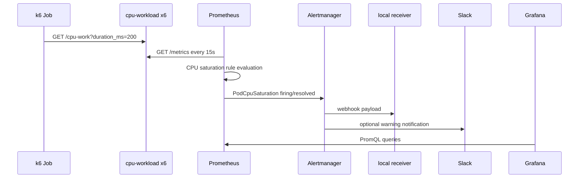

# 설계 문서

## 목표와 경계

이 프로젝트는 Rancher Desktop K3s 안에서 Kubernetes 애플리케이션의 CPU 포화를 재현하고, 메트릭 수집부터 시각화·알림 전달까지의 흐름을 관찰하기 위한 로컬 실습입니다. 인터넷에 공개되는 운영 환경을 위한 고가용성 구성은 범위에 포함하지 않습니다.

## 네임스페이스와 리소스

| Namespace | 리소스 | 책임 |
| --- | --- | --- |
| `monitoring` | Prometheus, Alertmanager, Grafana, PrometheusRule, Slack AlertmanagerConfig | 수집, 조회, 알림 라우팅 |
| `demo` | `cpu-workload` Deployment, Service, ServiceMonitor, `cpu-load` Job | CPU 부하 발생과 scrape 대상 제공 |
| `alerting` | `alert-receiver` Deployment 및 Service | Alertmanager 전달을 로컬에서 검증 |

기존 클러스터 워크로드는 이 프로젝트의 selector, namespace, teardown 대상에 포함하지 않습니다.

## 데이터 흐름



## 워크로드와 메트릭

`cpu-workload`는 다음 HTTP 인터페이스를 제공합니다.

| Endpoint | 용도 |
| --- | --- |
| `GET /healthz` | readiness/liveness probe |
| `GET /metrics` | `cpu_work_requests_total` 등 Prometheus 형식 메트릭 |
| `GET /cpu-work?duration_ms=...` | 요청 처리 중 CPU 작업 수행 |

Deployment는 6 replicas이며 각 container는 CPU request `100m`, limit `250m`을 갖습니다. 이 낮은 limit과 k6의 병렬 호출로 alert 조건을 안정적으로 재현합니다.

ServiceMonitor는 `cpu-workload` Service의 `http` 포트를 15초 간격으로 수집합니다. Service와 ServiceMonitor에 `release: monitoring` label을 두어 kube-prometheus-stack의 selector에 포함됩니다.

## 알림 규칙

`alerts/pod-cpu-saturation.yaml`의 `PodCpuSaturation`은 다음 비율을 Pod별로 계산합니다.

```promql
sum by (namespace, pod) (
  rate(container_cpu_usage_seconds_total{namespace="demo", container="workload", image!=""}[1m])
)
/
sum by (namespace, pod) (
  kube_pod_container_resource_limits{namespace="demo", container="workload", resource="cpu", unit="core"}
)
> 0.8
```

조건이 2분간 유지되어야 firing합니다. `severity: warning` label이 Slack AlertmanagerConfig의 route matcher와 일치합니다.

## 저장소와 리소스 정책

- Prometheus는 `local-path` StorageClass의 2 Gi PVC와 24시간 retention을 사용합니다.
- 로컬 단일 노드 환경에 맞춰 Prometheus, Grafana, Alertmanager에 CPU/메모리 request와 limit을 설정했습니다.
- Grafana dashboard ConfigMap은 `grafana_dashboard` label을 통해 sidecar가 자동 로드합니다.
- Grafana anonymous Viewer는 로컬 port-forward 편의용입니다. 외부 노출 환경에서는 비활성화하고 인증을 설정해야 합니다.

## 로컬 접근 방식

Rancher Desktop의 클러스터 Service DNS는 호스트 브라우저에서 해석되지 않습니다. 따라서 Alertmanager의 `externalUrl`은 `http://localhost:19093`으로 설정했고, `make alertmanager`가 같은 주소의 port-forward를 유지합니다. 이 명령이 실행 중일 때 Slack 메시지의 Alertmanager 링크를 열 수 있습니다.

Grafana도 ClusterIP Service이므로 `make dashboard`가 출력하는 port-forward 명령을 별도 터미널에서 실행합니다.

## Kafka MSA 벤치마크

`kafka-benchmark` namespace는 기존 `demo`, `alerting`, `monitoring`과 격리됩니다. k6는 `POST /events`로 `event_id`, 제출 시각, 256-byte payload를 전송합니다. ingest는 Kafka acknowledgement 후에만 202를 반환하고, consumer group의 각 replica는 PostgreSQL `INSERT ... ON CONFLICT DO NOTHING` 성공 뒤에만 Kafka offset을 commit합니다.

`benchmark_events.event_id`는 기본 키이므로 전달 중복은 conflict metric으로 관찰되지만 저장 행은 하나로 유지됩니다. producer accepted/failed, consumer inserted/conflict/lag, E2E 지연은 ServiceMonitor를 통해 Prometheus에 수집합니다.

단일 노드 용량에 맞춰 KRaft broker 1개와 replication factor/min ISR 1을 사용합니다. AWS 배포 시 이 부분은 MSK Provisioned 다중 AZ broker, EKS 다중 노드, RDS Multi-AZ로 대체해야 합니다.
